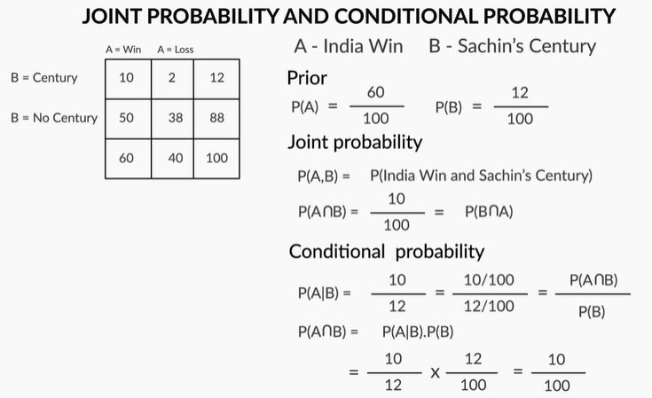

# Naive Bayes

## Introduction: Naive Bayes
Welcome to the module on ‘Naive Bayes’.

In this module, you will learn about another type of supervised classification, i.e. Naive Bayes. Naïve Bayes is a probabilistic classifier which returns the probability of a test point belonging to a class rather than the label of the test point. It is used in text based classification. Example classification of ham vs spam.

In this session, you will learn about the Bayes' Theorem and it's building blocks. You will be learning about conditional probability, joint probability and finally Bayes' theorem.

## Conditional Probability and Its Intuition

## Bayes' Theorem
In this section, you will understand Bayes’ Theorem for calculating the conditional probability. The example we will use now is something almost all of us can relate to which is cricket.

While watching cricket matches on TV, you may have seen statistics similar to this: “India wins 70% matches when Tendulkar scores a century.” Sounds like conditional probability? This is a classic example of how conditional probability can be used to estimate the chances of an event taking place, given certain other events that have happened.  

Suppose that India plays 100 matches, out of which it wins 60 and loses 40. Also, Sachin Tendulkar plays these 100 matches, scores a century in 12 of them, and doesn't score a century in the rest 88.

To make things interesting, you also have this additional information: out of the 60 games that India wins, Sachin scores a century in 10, and out of the 40 games that India loses, Sachin scores a century only in two.

Let us look how the two-way contingency matrix will look like for the above case :

Now, can you answer this question: what is the probability that India wins, given that Sachin has scored a century?

## Bayes' Theorem
Let's derive Bayes' theorem using joint and conditional probability using a two-way contingency table example.

We have learnt some important concepts related to Bayes’ theorem, i.e. conditional probability and joint probability.

## Naive Bayes For Categorical Data
In this session, you will understand Naive Bayes classifier through an example of mushrooms where the aim is to classify a new mushroom into edible or poisonous class. You will also learn that this algorithm uses probability to do such classification. You will follow the steps given below through the course of this session:
* Bayes Theorem 
* Naïve Bayes on Categorical data

### Naive Bayes -With One Feature
Welcome to the second session of ‘Naive Bayes’. In this session, you will implement Naive Bayes on a mushroom dataset. So, let's have a quick glance at the structure of the dataset.

[Mushroom Data Subset](datset/Mushroom-Subset.xlsx)

Type of mushroom is the target variable here. We will now implement Naïve Bayes on this mushroom dataset and try to classify a new test point into either of the two classes – edible or poisonous. As the name suggests, the Naive Bayes algorithm uses Bayes’ theorem to classify new test points. But, how exactly does it do this? 

Before we look at six variables together, lets consider a simplified sample containing only two columns i.e class label Ci (Type of mushroom) & X1 (which is Cap-shape). Lets apply Bayes theorem to classify this data point.

The effect of the denominator P(x) is not incorporated while calculating probabilities as it is the same for both the classes and hence, can be ignored without affecting the final outcome.

Since probablity of mushroom being edible given x is convex is higher so we can classify it in edible class.

A well-articulated explanation of Naive Bayes on https://stackoverflow.com/questions/10059594/a-simple-explanation-of-naive-bayes-classification

## Conditional Independence in Naive Bayes
In the previous segment, you understood the basic idea behind the working of Naive Bayes and how it is implemented on categorical data consisting of one feature and one target variable. In this case, the calculations for solving the classification problem are very simple as the probabilities can simply be calculated by counting. In this segment, you will understand how Naive Bayes would work if there are more than one feature in the data set.

Let's now consider another problem statement where we have below 3 columns. Lets try to classify a new input whose cap-shape is 'CONVEX' and Cap-surface is smooth.

Then apply Bayes theorem:

Naïve Bayes follows an assumption that the variables are **conditionally independent** given the class i.e. P(X = convex,smooth | C= edible) can be written as P(X=smooth | C=edible)\timesP(X=convex | C=edible). The terms P(X=smooth | C=edible) and P(X=convex | C=edible) is simply calculated by counting the data points. Hence, the name “Naïve” because in most real-world situations the variables are not conditionally independent given the class label but most of the times the algorithm works nonetheless.

Again in above cases we are not considering the effect of denominator.

## Deciphering Naive Bayes
You saw how conditional independence lets you calculate the class probability in cases where you have more than one feature. Now, in this segment, you will deal with the original five variable problem, where the new test point has the following features:  
* Cap Shape = Convex
* Cap Surface = Smooth
* Cap Colour = White
* Bruises = Yes
* Odour = None

Here the objective is to classify it into edible or poisonous class. Let's see how that can be done

Now that you know how to classify a data point with five features, you can generalise this classification rule for any number of features in the dataset.

### Prior, Posterior and Likelihood
Let’s understand the terminology of Bayes theorem.

You have been using 3 terms: P(Class = edible / poisonous), P(X | Class) and P(Class | X). Bayesian classification is based on the principle that ‘you combine your **prior knowledge or beliefs about a population** with the **case specific information** to get the actual (posterior) probability’.

* P(Class = edible) or P(Class = poisonous) is called the **prior probability**

This incorporates our **‘prior beliefs’** before you collect specific information. If 90% of mushrooms are edible, then the prior probability is 0.90. Prior gets multiplied with the likelihood to give the posterior. In many cases, the prior has a tremendous effect on the classification. If the prior is neutral (50% are edible), then the likelihood may largely decide the outcome.

* P(X|Class) is the **likelihood**

After agreeing upon the prior, you collect new, case-specific data (like plucking mushrooms randomly from a farm and observing the cap colours). Likelihood updates our prior beliefs with the new information. If you find a CONVEX mushroom, then you’d want to know how likely you were to find a convex one if you had only plucked edible mushrooms.

If  P(CONVEX| edible) is high, say 80%, implying that there was an 80% chance of getting a convex mushroom if you only took from edible mushrooms, this will reflect in increased chances of the mushroom being edible.

If the likelihood is neutral (e.g. 50%), then the prior probability may largely decide the outcome. If the prior is way too powerful, then likelihood often barely affects the result.

* P(Class = edible | X) is the **posterior probability**

It is the outcome which **combines prior beliefs and case-specific information**. It is a balanced outcome of the prior and the likelihood.

## Naive Bayes for Text Classification
In this session, we will learn about the Naive Bayes for text classification and understand how the classifier works in the background. Also, you we learn the python implementation of Naive Bayes for text classification problem.

Naive Bayes is commonly used for text classification in applications such as predicting spam emails, classifying text (e.g. news) into categories such as politics, sports, lifestyle etc. In general, Naive Bayes has proven to perform well in text classification applications.

### Document Classifier - Pre Processing Steps
In this session, you will learn how to build a Naive Bayes document classifier, i.e. a model for classifying text into categories.

Let’s first understand the problem statement and some necessary data preprocessing steps before building the actual classifier.

Let us suppose each sentence above represent a document and we have two classes i.e. education and cinema. So we need to classify the document whether they belong to cinema or education class.

So we will start by breaking sentences into words and put them in a bag(dictionary of unique words)

To summarise - you understood the data you are going to be working with and to convert the documents given into dictionary/vocabulary by removing ‘stop words’ which are not helpful for helping in document classification.

Great, we will now look  at how to use the vocabulary/dictionary to represent the given test documents by counting the occurences of various words. This is the way we represent the documents in **Multinomial Naive Bayes**.

We need to remember that this bag of words don't consider ordering of words but just how many words in a vocabulory occurs in the document.

So now we can represent each document as 12-dimentional vector, where each element tells how often a word occurs in the document.

### Document Classifier - Worked out Example
We will now learn how to classify new documents into classes ‘cinema’  and ‘education’. Using a worked out example, we will understand how the Naive Bayes classifier assigns class labels to documents.

So now that we have formulated the problem in terms of prior, posterior and likelihood, let us see how this can be tabulated to make our calculations easier.

Now, let's understand the actual process of classification using Multinomial Naive Bayes Classifier.

We will see how to counter the zero probability issue in the next segment.

### Laplace Smoothing
In the previous section, we encountered the ‘zero probability problem’ - the probability of a word which has never appeared in a class (though it may have appeared in the dataset in another class) is 0.

We will now understand how a technique called ‘Laplace smoothing’ helps solve this problem.

While trying to calculate the likelihood of a test document for a given class, it is possible that there exist certain words which although are a part of the dictionary but don't appear in the training documents of that class like the word pepsi does not appear in documents of hot class. Then, the probability of that word for that class becomes zero ( P(pepsi|hot) =0 )  and it makes the complete likelihood term zero. This is called the zero-probability problem.

To counter this problem, a ‘1’ is added to the total of every word count of all the words of the dictionary for that class. This increases the total word count for that class by the length of the dictionary. This technique is called Laplace Smoothing. After applying Laplace Smoothing, the updated table shown before will look like as follows -

Wasn’t that interesting? Did you notice how we could not assign any class label for our test document and got inconclusive results? That is where Laplace smoothing helps. How exactly does it help?

So basically we add one to each word occurrence. Some other laplace smoothing involves add one and then size of V (no. of words). But we will stick with adding 1 only.

You saw how Laplace smoothing helped solve the zero probability problem.

Please note that - If there are words occurring in a test sentence which are not a part of the dictionary, then they will not be considered as part of the feature vector since it only considers the words that are part of the dictionary. These new words will be completely ignored.

## Quick Introduction to Bernoulli Naive Bayes
Till now, we were studying the multinomial way of classifying documents. Now let’s briefly study Bernoulli Naive Bayes.

In Bernoulli Naive Bayes we don't care about how many times a word occur in the document, rather need to know wether the word occurred or not. So our new representation will only have zeros and ones. Even if a particular word occurs more than once, we just replace it with '1'. The following is the representation for doing Bernoulli's Naive Bayes.

You saw that the most fundamental difference in Bernoulli Naive Bayes Classifier is the way we build the bag of words representation, which in this case is just 0 or 1. Simply put, Bernoulli Naive Bayes is concerned only with whether the word is present or not in a document, whereas Multinomial Naive Bayes counts the no. of occurrences of the words as well.

The whole worked out example can be found below -

[Bernoulli Naive Bayes](dataset/Bernoulli_Calculation.pdf)

### Python Lab - Education Or Cinema ?
In this segment, we will learn how to implement both Multinomial and Bernoulli Naive Bayes classifiers in python.

Please download the python notebooks and the dataset from below.

[Train Data](dataset/example_train.csv)

[Test Data](dataset/example_test.csv)

[Python Notebook](dataset/Naive_Bayes_Multinomial_Bernoulli_+Demo.ipynb)

In the above notebook, we used Countvectorizer() which converted the documents into a set of unique words alphabetically sorted and indexed.We will be proceeding with the pre-processing steps required to fit a Naive Bayes model on it. 

**Stop Words:**

We can see a few trivial words such as 'and','is','of', etc. These words don't make any difference in classifying a document. These are called stop words. So we would like to get rid of them. We can remove them by passing a parameter stop_words='english' while instantiating Countvectorizer().

To Summarise, If we have a vast vocabulary of let's say 2000 or 3000 words, using a Sparse Matrix for Naive Bayes classifier will not be efficient. This is because a **Sparse Matrix** has so many zeros and storing so many zeros in the memory is a waste of memory. Refer to the image below.

Now the way to get rid of these is know as a **Compressed Sparse Row format**.

This representation can be understood as follows:

Consider first 4 rows of the output: (0,2), (0,5), (0,7) and (0,11). It says that the first document (index 0) has 7th , 2nd , 5th and 11th 'word' present in the document, and that they appear only once in the document- indicated by the right hand column entry.

Similarly, consider the entry (4,4) (third from bottom). It says that the fifth document has the fifth word present twice. Indeed, the 5th word('good') appears twice in the 5th document.
 da
In the next segment, you will implement both Multinomial and Bernoulli Naive Bayes classifiers on a realtaset to classify SMSes as spam or ham.

### Python Lab - SMS Spam Ham Classifier : Multinomial
We had mentioned earlier that Naive Bayes finds applications in spam detection. Let’s now see a full-fledged implementation of the Naive Bayes classifier in python on the ‘SMS dataset’.

We’ll build an SMS spam classifier and compare the results of Multinomial NB and Bernoulli NB. For detailed information about the dataset used you can refer to the link: SMS dataset (https://archive.ics.uci.edu/ml/datasets/SMS+Spam+Collection)

Please download the python notebooks and the dataset below.

[SMS Spam Ham dataset](dataset/SMSSpamCollection)

[Multinomial_NB_SMS](dataset/SMS+Classifier+_+Multinomial+Naive+Bayes.ipynb)

In the last section, we pre-processed our real SMS: Spam/Ham classifier data. Now  we will be building and evaluating the model based on Specificity, Sensitivity and ROC curve.

Sensitivity implies that out of all the actual Spam's, how many of them were correctly predicted by the model as Spam.  

Specificity implies that out of all the genuine SMS's, how many of them were correctly predicted as legitimate by the model.

If we look back to the problem statement, We are fine if some of the Spams are classified as Hams, but it will not be good if an important Ham is classified as Spam by our model. So our motive is to maximise Specificity.

ROC Curves are used to see how well your classifier can separate positive and negative examples and to identify the best threshold for separating them.

The area under the ROC Curve shows how far the curve from the base line. For the baseline it's 0.5, and for the perfect classifier it's 1. In our case the AUC obtained was 99% which is very good.

### Python Lab - SMS Spam Ham Classifier : Bernoulli
In the last section, we looked at the Naive Bayes Multinomial Classifier to classify the SMS Spam/Ham data. In this session, we will be using the same dataset but will be fitting a Bernoulli Navie Bayes Classifier.

Please download the python notebooks used in this section.

[Naive Bayes Bernoulli](dataset/SMS+Classifier+_+Bernoulli+NB.ipynb)

Did you note how business objectives govern our model evaluation and selection? In this case, you wanted the False positives i.e the ham being classified as spam as low as possible which you could achieve by using Bernoulli Naive Bayes classifier even though the overall accuracy and sensitivity was less than Multinomial Naive Bayes classifier.

