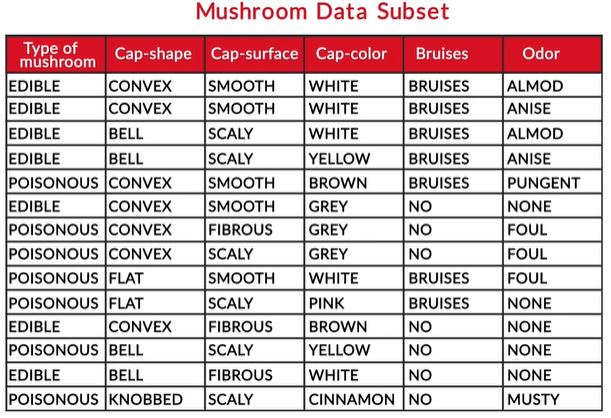
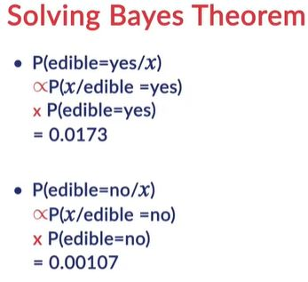
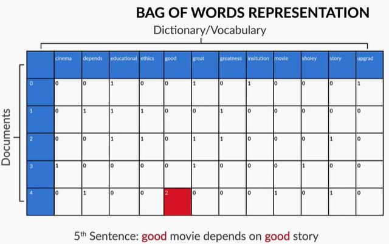

# Naive Bayes

## Introduction: Naive Bayes
Welcome to the module on ‘Naive Bayes’.

In this module, you will learn about another type of supervised classification, i.e. Naive Bayes. Naïve Bayes is a probabilistic classifier which returns the probability of a test point belonging to a class rather than the label of the test point. It is used in text based classification. Example classification of ham vs spam.

In this session, you will learn about the Bayes' Theorem and it's building blocks. You will be learning about conditional probability, joint probability and finally Bayes' theorem.

## Conditional Probability and Its Intuition

## Bayes' Theorem
In this section, you will understand Bayes’ Theorem for calculating the conditional probability. The example we will use now is something almost all of us can relate to which is cricket.

While watching cricket matches on TV, you may have seen statistics similar to this: “India wins 70% matches when Tendulkar scores a century.” Sounds like conditional probability? This is a classic example of how conditional probability can be used to estimate the chances of an event taking place, given certain other events that have happened.  

Suppose that India plays 100 matches, out of which it wins 60 and loses 40. Also, Sachin Tendulkar plays these 100 matches, scores a century in 12 of them, and doesn't score a century in the rest 88.

To make things interesting, you also have this additional information: out of the 60 games that India wins, Sachin scores a century in 10, and out of the 40 games that India loses, Sachin scores a century only in two.

Let us look how the two-way contingency matrix will look like for the above case :

Now, can you answer this question: what is the probability that India wins, given that Sachin has scored a century?

## Bayes' Theorem
Let's derive Bayes' theorem using joint and conditional probability using a two-way contingency table example.

We have learnt some important concepts related to Bayes’ theorem, i.e. conditional probability and joint probability.

## Naive Bayes For Categorical Data
In this session, you will understand Naive Bayes classifier through an example of mushrooms where the aim is to classify a new mushroom into edible or poisonous class. You will also learn that this algorithm uses probability to do such classification. You will follow the steps given below through the course of this session:
* Bayes Theorem 
* Naïve Bayes on Categorical data

### Naive Bayes -With One Feature
Welcome to the second session of ‘Naive Bayes’. In this session, you will implement Naive Bayes on a mushroom dataset. So, let's have a quick glance at the structure of the dataset.

[Mushroom Data Subset](datset/Mushroom-Subset.xlsx)

Type of mushroom is the target variable here. We will now implement Naïve Bayes on this mushroom dataset and try to classify a new test point into either of the two classes – edible or poisonous. As the name suggests, the Naive Bayes algorithm uses Bayes’ theorem to classify new test points. But, how exactly does it do this? 

Before we look at six variables together, lets consider a simplified sample containing only two columns i.e class label Ci (Type of mushroom) & X1 (which is Cap-shape). Lets apply Bayes theorem to classify this data point.

The effect of the denominator P(x) is not incorporated while calculating probabilities as it is the same for both the classes and hence, can be ignored without affecting the final outcome.

Since probablity of mushroom being edible given x is convex is higher so we can classify it in edible class.

A well-articulated explanation of Naive Bayes on https://stackoverflow.com/questions/10059594/a-simple-explanation-of-naive-bayes-classification

## Conditional Independence in Naive Bayes
In the previous segment, you understood the basic idea behind the working of Naive Bayes and how it is implemented on categorical data consisting of one feature and one target variable. In this case, the calculations for solving the classification problem are very simple as the probabilities can simply be calculated by counting. In this segment, you will understand how Naive Bayes would work if there are more than one feature in the data set.

Let's now consider another problem statement where we have below 3 columns. Lets try to classify a new input whose cap-shape is 'CONVEX' and Cap-surface is smooth.

Then apply Bayes theorem:

Naïve Bayes follows an assumption that the variables are **conditionally independent** given the class i.e. P(X = convex,smooth | C= edible) can be written as P(X=smooth | C=edible)\timesP(X=convex | C=edible). The terms P(X=smooth | C=edible) and P(X=convex | C=edible) is simply calculated by counting the data points. Hence, the name “Naïve” because in most real-world situations the variables are not conditionally independent given the class label but most of the times the algorithm works nonetheless.

Again in above cases we are not considering the effect of denominator.

## Deciphering Naive Bayes
You saw how conditional independence lets you calculate the class probability in cases where you have more than one feature. Now, in this segment, you will deal with the original five variable problem, where the new test point has the following features:  
* Cap Shape = Convex
* Cap Surface = Smooth
* Cap Colour = White
* Bruises = Yes
* Odour = None

Here the objective is to classify it into edible or poisonous class. Let's see how that can be done

Now that you know how to classify a data point with five features, you can generalise this classification rule for any number of features in the dataset.

### Prior, Posterior and Likelihood
Let’s understand the terminology of Bayes theorem.

You have been using 3 terms: P(Class = edible / poisonous), P(X | Class) and P(Class | X). Bayesian classification is based on the principle that ‘you combine your **prior knowledge or beliefs about a population** with the **case specific information** to get the actual (posterior) probability’.

* P(Class = edible) or P(Class = poisonous) is called the **prior probability**

This incorporates our **‘prior beliefs’** before you collect specific information. If 90% of mushrooms are edible, then the prior probability is 0.90. Prior gets multiplied with the likelihood to give the posterior. In many cases, the prior has a tremendous effect on the classification. If the prior is neutral (50% are edible), then the likelihood may largely decide the outcome.

* P(X|Class) is the **likelihood**

After agreeing upon the prior, you collect new, case-specific data (like plucking mushrooms randomly from a farm and observing the cap colours). Likelihood updates our prior beliefs with the new information. If you find a CONVEX mushroom, then you’d want to know how likely you were to find a convex one if you had only plucked edible mushrooms.

If  P(CONVEX| edible) is high, say 80%, implying that there was an 80% chance of getting a convex mushroom if you only took from edible mushrooms, this will reflect in increased chances of the mushroom being edible.

If the likelihood is neutral (e.g. 50%), then the prior probability may largely decide the outcome. If the prior is way too powerful, then likelihood often barely affects the result.

* P(Class = edible | X) is the **posterior probability**

It is the outcome which **combines prior beliefs and case-specific information**. It is a balanced outcome of the prior and the likelihood.

## Naive Bayes for Text Classification
In this session, we will learn about the Naive Bayes for text classification and understand how the classifier works in the background. Also, you we learn the python implementation of Naive Bayes for text classification problem.

Naive Bayes is commonly used for text classification in applications such as predicting spam emails, classifying text (e.g. news) into categories such as politics, sports, lifestyle etc. In general, Naive Bayes has proven to perform well in text classification applications.

### Document Classifier - Pre Processing Steps
In this session, you will learn how to build a Naive Bayes document classifier, i.e. a model for classifying text into categories.

Let’s first understand the problem statement and some necessary data preprocessing steps before building the actual classifier.

Let us suppose each sentence above represent a document and we have two classes i.e. education and cinema. So we need to classify the document whether they belong to cinema or education class.

So we will start by breaking sentences into words and put them in a bag(dictionary of unique words)

To summarise - you understood the data you are going to be working with and to convert the documents given into dictionary/vocabulary by removing ‘stop words’ which are not helpful for helping in document classification.

Great, we will now look  at how to use the vocabulary/dictionary to represent the given test documents by counting the occurences of various words. This is the way we represent the documents in **Multinomial Naive Bayes**.

We need to remember that this bag of words don't consider ordering of words but just how many words in a vocabulory occurs in the document.

So now we can represent each document as 12-dimentional vector, where each element tells how often a word occurs in the document.

